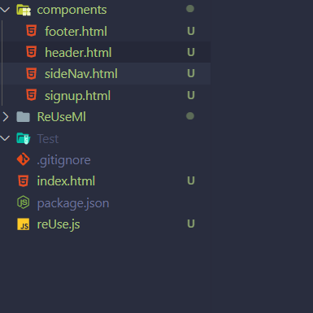

# reUseMl
A simple library written in 8 lines of Es6 JS to render html components 

# Installation
 For your simple usage of ReUSe dowload
 
 # Set-Up
 > Create a directory of `/components` and store all your markup components
 
 <br>
 
 > For small projects you can have your styling in your html using `<style></style>` tags  
 
 # Usage
> Add the `reUse.js` file to html code, then also create another javascript file where you call the render method <br>
 
 ```
 <script src='reUse.js'></script>
  <script src='app.js'></script>
 ```
> In your `app.js`, if you want to render a `header.html` component into your container with an Id of `#header`

```
const reuse = new ReUseMl();
reuse.render('components/header.html', '#header');
```
 
