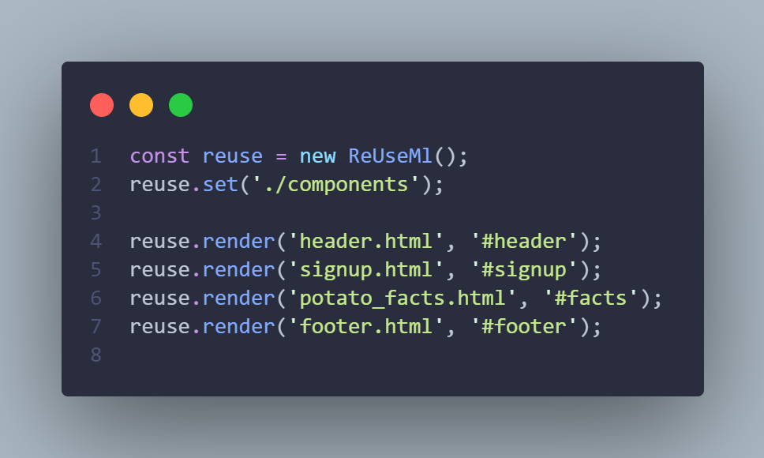
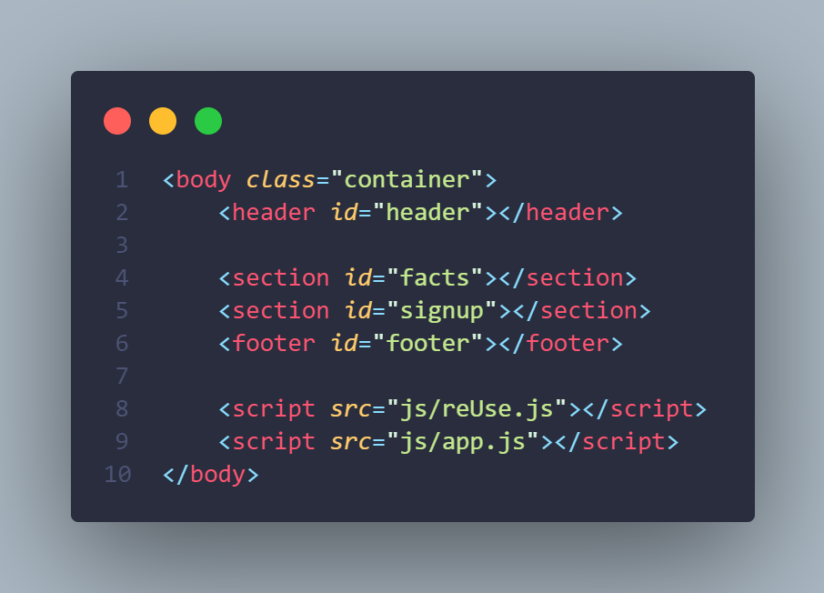

# ReUseMarkup
You create your html components and use the reUseMl script to render them to your html document
# Installation
 For your simple usage of ReUSe dowload from [Here](https://github.com/Akohjesse/reUseMl/archive/refs/tags/v1.2.zip)
 
 # Set-Up
 > Create a directory of `/components` and store all your markup components , For small projects you can have your styling in your html using `<style></style>` tags
 >    <br>
 >    
 # Usage
> Add the `reUse.js` file or minified `reUse.min.js` to html code, then also create another javascript file where you call the render method <br>
 
 ```
  <script src='reUse.min.js'></script>
  <script src='app.js'></script>
 ```
 
> In your `app.js`, if you want to render a `header.html` component into your container with an Id of `#header`
> You instantiate reuse from ReUseMl(), then set the views or directory where it'll search for your components, using the `reuse.set()` method 
> ```
> const reuse = new ReUseMl();
> reuse.set('./components)
> ```

```
reuse.render('header.html', '#header');
```
 
# Example
 > Check [here](https://github.com/Akohjesse/reUseMl/tree/main/example) for an example using the library or clone repo and open 
## License
Distributed under the MIT license. See [LICENSE](https://github.com/Akohjesse/reUseMl/blob/main/LICENSE) for more information
